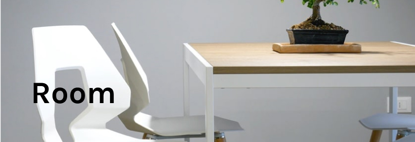

# room

<p align="center" >



</p>
<p align="center">
    
</p>

## 🧪 Technologies
<br>
This project was developed using the following technologies:


- [TypeScript](https://www.typescriptlang.org/)
- [ReactJs](https://reactjs.org/)
- [ViteJs](https://vitejs.dev/)
- [Styled Components](https://styled-components.com/)


## 🚀 Getting started
<br>

Clone the project and access the folder.

Run this command to install the dependencies.

```bash
git clone https://github.com/eziiel/room.git

cd room

npm install

npm run dev
```

## 🔖 Layout

You can view the project through the links below:

- [Live Preview](#)

## 📝 License


<br>
<br>

This project is licensed under the MIT License. See the [LICENSE](https://opensource.org/licenses/MIT) file for details.


<br>
<br>
<br>

<hr>
<br>
<p align="center">🚧🔧Project in Contruction.🔧🚧 </p>
<br>


<hr>
<br>
<br>
<br>

Made with 💜 by [eziiel](https://github.com/eziiel) 🙌🚀

